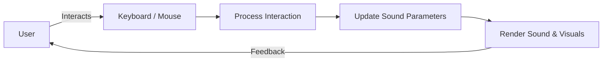

# 🎶 String Synthesizer with Interactive Pedals

Welcome to my **String Synthesizer** project! This is a digital synthesizer built using p5.js and Tone.js, allowing users to explore sound through interactive pedals and keyboard notes. Whether you're into music, coding, or just curious, this project has something for you!

## 🌟 Features

- **🎹 Interactive Piano**: Play notes directly on your screen with a visual piano.
- **🎛️ Modulation Pedal**: Adjust pitch and amplitude with a rotating knob.
- **🎚️ Pitch Shift Pedal**: Transpose notes up or down within a ±1 Hz range.
- **🔒 Sostenuto Pedal**: Sustain selected notes for a richer sound.

## 🖼️ Interface Overview


### 1. **Piano Keys**
   - White and black keys at the bottom of the screen represent different notes from C4 to C5.
   - Click to play, and the waveform will visualize the sound.

### 2. **Waveform Display**
   - Real-time audio waveform visualization that updates as you play.
   - The waveform is a direct representation of the sound produced by the synth.

### 3. **Pedals**
   - **Sostenuto Pedal**: Toggle to sustain or release notes.
   - **Modulation Pedal**: Adjust modulation depth with a knob.
   - **Pitch Shift Pedal**: Slide to shift the pitch of notes.

## 🛠️ How It Works

### Synth Setup

The synthesizer uses **Tone.js** to create a rich sound experience. Each note is represented by an oscillator with parameters fine-tuned for a string-like sound.

```javascript
let synths = {};
Object.keys(noteFrequencies).forEach(note => {
  synths[note] = new Tone.PolySynth(Tone.FMSynth, {
    harmonicity: 3,
    oscillator: {
      type: "sine"
    },
    envelope: {
      attack: 0.1,
      decay: 0.2,
      sustain: 0.8,
      release: 1.5
    },
    modulation: {
      type: "square"
    },
    modulationEnvelope: {
      attack: 0.5,
      decay: 0,
      sustain: 1,
      release: 0.5
    }
  }).chain(synthParams.chorus, synthParams.reverb, synthParams.tremolo).toDestination();
});
```

### Interactive Pedals

#### 🦶 Sostenuto Pedal
- **Functionality**: Holds the currently playing notes, allowing selective sustain.
- **Implementation**: A toggle button that cycles through three states—off, holding, and not sustaining new notes.

```javascript
if (dist(sPedalToggleCoords[0], sPedalToggleCoords[1], mouseX, mouseY) < 25){
  sostenutoPedal = (sostenutoPedal + 1) % 3;
}
```

#### 🔄 Modulation Pedal
- **Functionality**: Modulates the pitch or amplitude of notes.
- **Implementation**: A knob that adjusts the modulation depth by rotating around its axis.

```javascript
anglePointer = constrain(anglePointer, -PI/4, PI/4);
synthParams.modDepth = map(anglePointer, -PI/4, PI/4, -100, 100);
```

#### 📈 Pitch Shift Pedal
- **Functionality**: Shifts the pitch of the played notes within a ±1 Hz range.
- **Implementation**: A slider that maps to a frequency range, altering the pitch dynamically.

```javascript
pitchShift = map(psPedalSlider, sliderX1, sliderX2, -1, 1);
let freq = map(pitchShift, -1, 0, minFrequency, playedFreq);
```

## 📊 Flow Diagram



## 🚀 Getting Started

### Prerequisites

- [p5.js](https://p5js.org/)
- [Tone.js](https://tonejs.github.io/)

### Installation

1. Clone the repository:

   ```bash
   git clone https://github.com/William-Laverty/String-Synthesiser.git
   ```

2. Open `index.html` in your web browser.

3. Start exploring the sonic realm! 🎧

## 📚 Documentation

- [p5.js Documentation](https://p5js.org/reference/)
- [Tone.js Documentation](https://tonejs.github.io/docs/)

## 📝 License

This project is licensed under the MIT License - see the [LICENSE](https://github.com/William-Laverty/String-Synthesiser/blob/main/LICENSE) file for details.

## 💬 Feedback

Feel free to open an issue if you find a bug or have a feature request! Contributions are welcome. 
